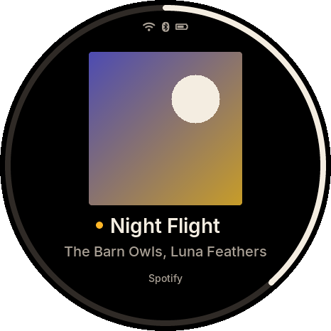
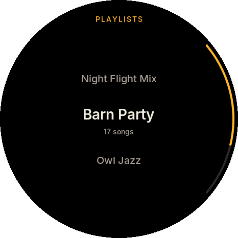
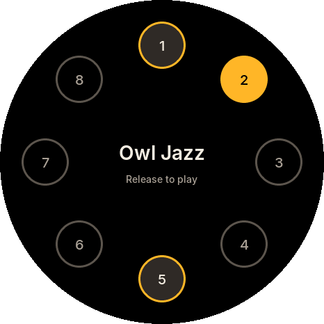
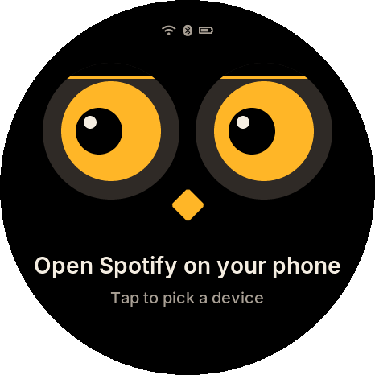

# OwlTunes

OwlTunes is an owl-shaped remote control for Spotify that sits on your desk and fits in your
pocket.

It controls the music that is already playing on your phone, computer or speakers; it plays no
audio itself. Turn the ring around its round screen to change the volume or scroll, tap to pause,
press an ear to skip, and browse your playlists and devices without taking your phone out. Put it
on its perch and it becomes a desk display that charges while it shows what is playing.

**Status:** early development. The design is complete and the firmware, simulator, PCB and
enclosure are being built in the open. Read the
[system design](docs/design/2026-10-04-owltunes-system-design.md) for the full picture.

## How it works

- **The owl:** ESP32-S3, 1.75 inch round AMOLED touch display, a rotating ring with haptic
  clicks, two ear buttons, a beak button, a battery and USB-C.
- **The perch:** a weighted magnetic desk dock that charges the owl through spring contacts.
- **Spotify:** the owl talks to the Spotify Web API over Wi-Fi (home network or phone hotspot).
  Bluetooth media keys keep play, skip and volume working when there is no internet.

## What it looks like

These are real renders from the simulator, which runs the same UI code as the firmware.

| Now playing | Playlists | Preset wheel | Looking for your phone |
|---|---|---|---|
|  |  |  |  |

The album art is a generated placeholder; the device shows the real cover.

## Repository layout

| Path | Contents |
|---|---|
| `docs/` | Design documents and guides |
| `firmware/` | ESP-IDF firmware; `firmware/components/` holds the shared C code |
| `sim/` | Desktop simulator and golden screenshots |
| `tools/` | Build, test, style and font scripts |

## Building

Linux with CMake 3.22+, Ninja and a C compiler.

| What | Command |
|---|---|
| Unit tests (with sanitizers) | `tools/test_host.sh` |
| Simulator screenshot tests | `tools/sim.sh` |
| Interactive simulator (needs `libsdl2-dev`) | `cmake -S sim -B build/sim-sdl -G Ninja -DOWL_SIM_SDL=ON && cmake --build build/sim-sdl && build/sim-sdl/owl_sim sdl` |
| Firmware (ESP-IDF v6.1 activated) | `tools/firmware.sh build` |
| Firmware in the QEMU emulator | `tools/qemu_smoke.sh` |
| Regenerate the UI fonts (needs Node.js) | `tools/gen_fonts.sh` |

The UI font is [Inter](https://rsms.me/inter/) (SIL Open Font License, see
`firmware/components/owl_ui/fonts/LICENSE-Inter.txt`).

## Using it with Spotify

OwlTunes needs Spotify Premium and your own free Spotify developer app (client ID). It uses the
Authorization Code flow with PKCE, so no client secret is ever stored on the device or in this
repository.

## Licences

- Software: [MIT](LICENSE)
- Hardware and enclosure designs: [CERN-OHL-P-2.0](LICENSE-HARDWARE)

## Not affiliated with Spotify

OwlTunes is an independent, non-commercial project. It is not affiliated with, endorsed by or
sponsored by Spotify. Spotify is a trademark of Spotify AB.
